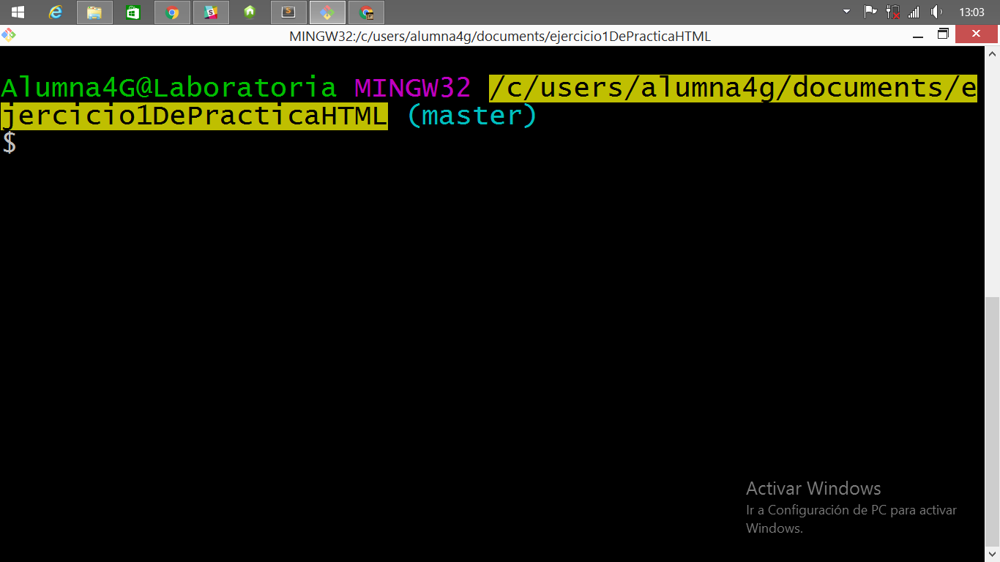
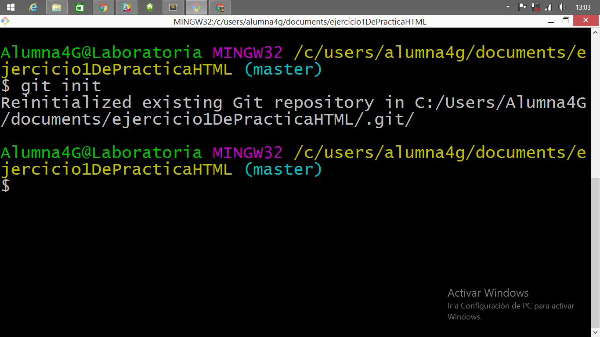
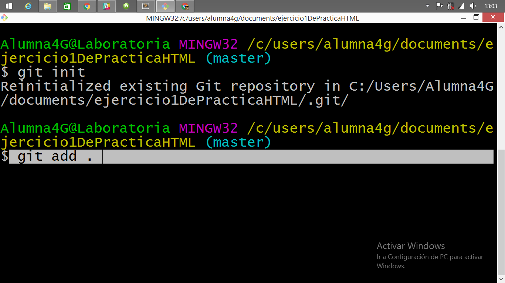
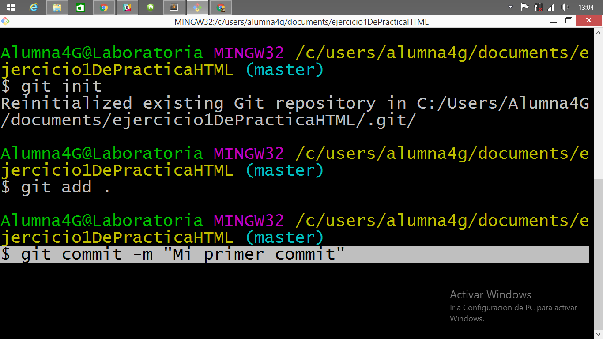
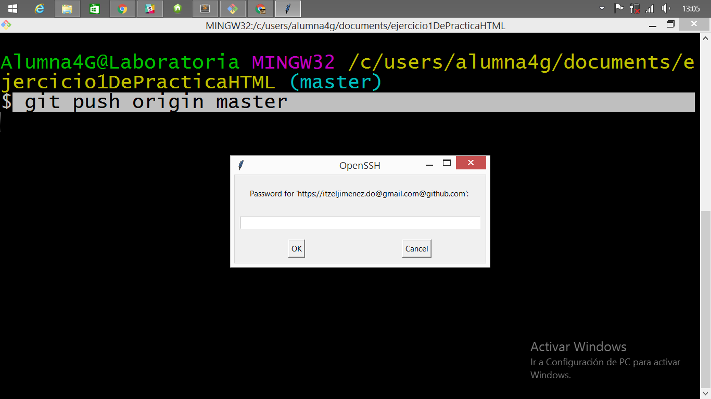
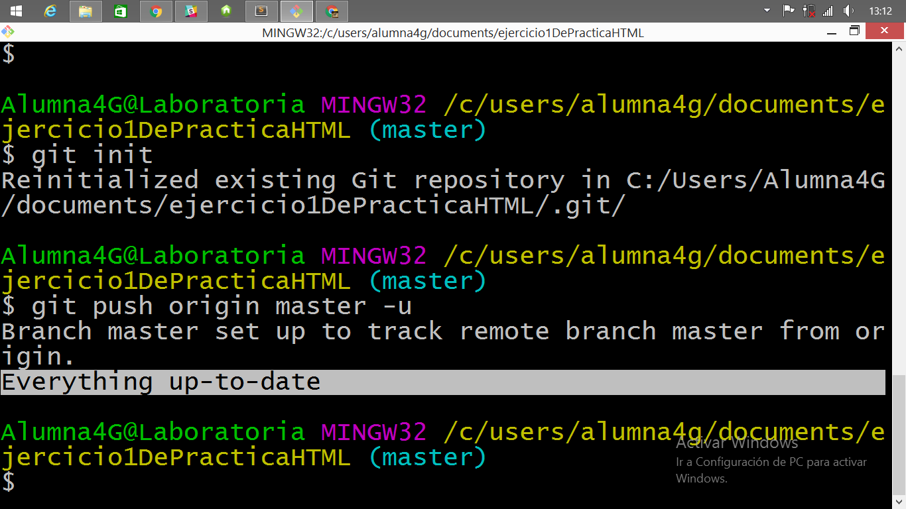

# leccion-12

PASOS BASICOS PARA COMENZAR A TRABAJAR GIT

PREPARANDO EL TERRENO:
Primero debes ubicarte en la carpeta que deseas subir a tu repositorio. Supondremos que ya has creado un repositorio en Github y que tienes algún archivo que desees subir o que hayas modificado sobre la carpeta. 
- Deberas escribir en Git bash la ruta sobre la que desees trabajar.

Format: 
---

- Inicializar
Una vez en la dirección adecuada, vamos a inicializar git, escribiendo el siguiente comando.

Format: 

---
- Modificar:
Todo cambio que hayas hecho a la carpeta existente deberá ser reconocido por git y añadirse a la nueva carpeta, para ello existen dos comandos git add "nombredelarchivo.extensión" que si bien sirve para subir archivo, lo hace unicamente para subir uno, si queremos subir un bloque de archivos modificados deberemos usar el siguiente comando. 

Format: 
---
- Commit:
Los commits no sirven para decirle a git que estamos seguros de querer subir el archivo y nos permite ponerle una etiqueta que podremos tener como referencia en el hitorial del archivo. Con ello confirmamos que el archivo está listo para subirse. El comando respectivo es el siguiente

Format: 
---
ESTAMOS LISTOS PARA SUBIR LAS MODIFICACIONES
- git Push
Con git push podremos enviar nuestros archivo locales a la plataforma de github y con ello obtener todas las ventajas que ello ofrece. Veamos la ejecución del código.

Format: 
. . .
pero espera... ¿Que carajos es esa ventanita que no me deja subir mi archivo?
Antes que otra cosa deberíamos saber que para utilizar una plataforma y que ella aloje nuestros archivos, usuario y demás, debemos registrarnos en ella. Como aqui suponemos que ya creaste tu cuenta en Github junto con tu repositorio, no pasa nada grave cuando la ventanita emergente ataca. Sólo tenemos que introducir nuestros datos de usuario en Github y Listo. 

Al deshacernos de la salvaje ventana debería aparecernos algo como la siguiente imagen, ello indica que nuestras modificaciones se han logrado subir a la plataforma con éxito.

Format: 

---
FIN